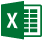

    <ul class="cardsY panelContent featuredContent">
        <li>
            <a href="https://graph.microsoft.io/en-us/docs/overview/overview">
                

                    

                        

                            

                                

                                    
                                

                            

                            

                                <h3>Introducing the MS Graph</h3>
                            

                        

                    

                

            </a>
        </li>
        <li>
            <a href="https://graph.microsoft.io/en-us/graph-explorer">
                

                    

                        

                            

                                

                                    
                                

                            

                            

                                <h3>Explore the Graph online</h3>
                            

                        

                    

                

            </a>
        </li>
        <li>
            <a href="https://graph.microsoft.io/en-us/getting-started">
                

                    

                        

                            

                                

                                    
                                

                            

                            

                                <h3>Try the Graph Quickstart</h3>
                            

                        

                    

                

            </a>
        </li>
    </ul>

    <ul class="pivots">
        <li>
            <a href="#docs">Documentation</a>
            <ul id="docs">
              <li>
                <a data-default="true" href="#getstarted">Getting Started</a>
                <ul id="getstarted" class="cardsA">
                    <li>
                        <a href="https://graph.microsoft.io/en-us/docs/overview/overview">
                            

                                

                                    

                                        

                                        

                                        

                                            <h3>Build your first app</h3>
                                            
Build a 'hello world' app in the language of your choice.

                                            

                                              
                                              
                                              
                                              
                                              
                                              
                                              
                                              
                                            

                                        

                                    

                                

                            

                        </a>
                    </li>
                    <!-- <li>
                        <a href="https://graph.microsoft.io/en-us/docs/overview/overview">
                            

                                

                                    

                                        

                                            

                                                
                                            

                                        

                                        

                                            <h3>Getting started option 2</h3>
                                            
Some other text here.

                                        

                                    

                                

                            

                        </a>
                    </li>
                    <li>
                        <a href="https://graph.microsoft.io/en-us/docs/overview/overview">
                            

                                

                                    

                                        

                                            

                                                
                                            

                                        

                                        

                                            <h3>Getting started option 3</h3>
                                            
Some other text here.

                                        

                                    

                                

                            

                        </a>
                    </li> -->

                  </ul>
              </li>
              <li>
                <a data-default="true" href="#basics">Basics</a>
                <ul id="basics" class="cardsA">
                    <li>
                        <a href="https://graph.microsoft.io/en-us/docs/overview/overview">
                            

                                

                                    

                                        

                                            

                                                
                                            

                                        

                                        

                                            <h3>Overview</h3>
                                            
Link to conceptual overview topic.

                                        

                                    

                                

                            

                        </a>
                    </li>
                    <li>
                        <a href="https://graph.microsoft.io/en-us/docs/authorization/auth_overview">
                            

                                

                                    

                                        

                                            

                                                
                                            

                                        

                                        

                                            <h3>Authenticate users</h3>
                                            
Authenticate using Azure AD or Azure AD v2.0 services.

                                        

                                    

                                

                            

                        </a>
                    </li>
                    <li>
                        <a href="https://graph.microsoft.io/en-us/docs/overview/call_api">
                            

                                

                                    

                                        

                                            

                                                
                                            

                                        

                                        

                                            <h3>Call the API</h3>
                                            
Access and manipulate resources through RESTful HTTP operations.

                                        

                                    

                                

                            

                        </a>
                    </li>
                    <li>
                        <a href="https://graph.microsoft.io/en-us/docs/overview/query_parameters">
                            

                                

                                    

                                        

                                            

                                                
                                            

                                        

                                        

                                            <h3>Query parameters</h3>
                                            
User optional paramters to specify and control the amount of data returned in a response.

                                        

                                    

                                

                            

                        </a>
                    </li>
                    <li>
                        <a href="https://graph.microsoft.io/en-us/docs/concepts/paging">
                            

                                

                                    

                                        

                                            

                                                
                                            

                                        

                                        

                                            <h3>Page Microsoft Graph data</h3>
                                            
Use paging to break information returned into manageable chunks. 

                                        

                                    

                                

                            

                        </a>
                    </li>
                    <li>
                        <a href="https://graph.microsoft.io/en-us/docs/overview/errors">
                            

                                

                                    

                                        

                                            

                                                
                                            

                                        

                                        

                                            <h3>Troubleshoot errors.</h3>
                                            
Using standard HTTP status codes, as well as a JSON error response object.

                                        

                                    

                                

                            

                        </a>
                    </li>

                  </ul>
              </li>
                        <li>
                          <a data-default="true" href="#indepth">Explore in-depth</a>
                          <ul id="indepth" class="cardsA">
                              <li>
                                  <a href="https://graph.microsoft.io/en-us/docs/concepts/delta_query_overview">
                                      

                                          

                                              

                                                  

                                                      

                                                          
                                                      

                                                  

                                                  

                                                      <h3>Delta query (preview)</h3>
                                                      
Discover newly created, updated, or deleted entities without performing a full read of the target resource. 

                                                  

                                              

                                          

                                      

                                  </a>
                              </li>
                              <li>
                                  <a href="https://graph.microsoft.io/en-us/docs/concepts/hybrid_rest_support">
                                      

                                          

                                              

                                                  

                                                      

                                                          
                                                      

                                                  

                                                  

                                                      <h3>Hybrid deployments</h3>
                                                      
Some other text here.

                                                  

                                              

                                          

                                      

                                  </a>
                              </li>
                              <li>
                                  <a href="https://graph.microsoft.io/en-us/docs/concepts/deployments">
                                      

                                          

                                              

                                                  

                                                      

                                                          
                                                      

                                                  

                                                  

                                                      <h3>Sovereign deployments</h3>
                                                      
Information about the different sovereign cloud instances of Microsoft Graph.

                                                  

                                              

                                          

                                      

                                  </a>
                              </li>
                              <li>
                                  <a href="https://graph.microsoft.io/en-us/docs/api-reference/v1.0/resources/webhooks">
                                      

                                          

                                              

                                                  

                                                      

                                                          
                                                      

                                                  

                                                  

                                                      <h3>Webhooks</h3>
                                                      
Subscribe your app to changes on Microsoft Graph resources.

                                                  

                                              

                                          

                                      

                                  </a>
                              </li>

                            </ul>
                        </li>

                        <li>
                          <a data-default="true" href="#apis">API reference</a>

                          <ul id="apis" class="cardsA">

                              <li>
                                      

                                          

                                              

                                                  

                                                      

                                                          
                                                      

                                                  

                                                  

                                                      <a href="https://graph.microsoft.io/en-us/docs/api-reference/v1.0/resources/message">
                                                        
Mail

                                                      </a>
                                                      <a href="https://graph.microsoft.io/en-us/docs/api-reference/v1.0/resources/calendar">
                                                        
Calendar

                                                      </a>
                                                      <a href="https://graph.microsoft.io/en-us/docs/api-reference/v1.0/resources/contact">
                                                        
Contacts

                                                      </a>
                                                  

                                              

                                          

                                      

                              </li>
                              <li>
                                      

                                          

                                              

                                                  

                                                      

                                                          
                                                      

                                                  

                                                  

                                                      <a href="https://graph.microsoft.io/en-us/docs/api-reference/v1.0/resources/directoryobject">
                                                        
Directory

                                                      </a>
                                                      <a href="https://graph.microsoft.io/en-us/docs/api-reference/v1.0/resources/group">
                                                        
Groups

                                                      </a>
                                                      <a href="https://graph.microsoft.io/en-us/docs/api-reference/v1.0/resources/users">
                                                        
Users

                                                      </a>
                                                  

                                              

                                          

                                      

                              </li>
                              <li>
                                      

                                          

                                              

                                                  

                                                      

                                                          
                                                      

                                                  

                                                  

                                                      <a href="https://graph.microsoft.io/en-us/docs/api-reference/v1.0/resources/drive">
                                                        
Drive

                                                      </a>
                                                      <a href="https://graph.microsoft.io/en-us/docs/api-reference/v1.0/resources/driveitem">
                                                        
DriveItem

                                                      </a>
                                                  

                                              

                                          

                                      

                              </li>
                              <li>
                                      

                                          

                                              

                                                  

                                                      

                                                          
                                                      

                                                  

                                                  

                                                      <a href="https://graph.microsoft.io/en-us/docs/api-reference/v1.0/resources/excel">
                                                        
Workbook

                                                      </a>
                                                  

                                              

                                          

                                      

                              </li>
                              <li>
                                      

                                          

                                              

                                                  

                                                      

                                                          
                                                      

                                                  

                                                  

                                                      <a href="https://graph.microsoft.io/en-us/docs/api-reference/v1.0/resources/attachment">
                                                        
Attachment

                                                      </a>
                                                      <a href="https://graph.microsoft.io/en-us/docs/api-reference/v1.0/resources/opentypeextension">
                                                        
DataExtensions

                                                      </a>
                                                      <a href="https://graph.microsoft.io/en-us/docs/api-reference/v1.0/resources/webhooks">
                                                        
Webhooks

                                                      </a>
                                                  

                                              

                                          

                                      

                              </li>
                            </ul>
                        </li>
                        <li>
                          <a data-default="true" href="#beta">Beta reference</a>

                          <ul id="beta" class="cardsA">
                            <li>
                                    

                                        

                                            

                                                

                                                    

                                                        
                                                    

                                                

                                                

                                                    <a href="https://graph.microsoft.io/en-us/docs/api-reference/beta/resources/person">
                                                      
Person

                                                    </a>
                                                    <a href="https://graph.microsoft.io/en-us/docs/api-reference/beta/resources/mention">
                                                      
Mention

                                                    </a>
                                                

                                            

                                        

                                    

                            </li>
                            <li>
                                    

                                        

                                            

                                                

                                                    

                                                        
                                                    

                                                

                                                

                                                    <a href="https://graph.microsoft.io/en-us/docs/api-reference/beta/resources/task">
                                                      
Tasks

                                                    </a>
                                                

                                            

                                        

                                    

                            </li>
                            <li>
                                    

                                        

                                            

                                                

                                                    

                                                        
                                                    

                                                

                                                

                                                    <a href="https://graph.microsoft.io/en-us/docs/api-reference/beta/resources/sharepoint">
                                                      
Sites

                                                    </a>
                                                    <a href="https://graph.microsoft.io/en-us/docs/api-reference/beta/resources/list">
                                                      
Lists

                                                    </a>
                                                    <a href="https://graph.microsoft.io/en-us/docs/api-reference/beta/resources/listitem">
                                                      
ListItems

                                                    </a>
                                                

                                            

                                        

                                    

                            </li>
                            <li>
                                    

                                        

                                            

                                                

                                                    

                                                        
                                                    

                                                

                                                

                                                  <a href="https://graph.microsoft.io/en-us/docs/api-reference/beta/resources/privilegedidentitymanagement_root">
                                                    
Privileged Identity

                                                  </a>
                                                  <a href="https://graph.microsoft.io/en-us/docs/api-reference/beta/resources/identityprotection_root">
                                                    
Identity Protection

                                                  </a>
                                                  <a href="https://graph.microsoft.io/en-us/docs/api-reference/beta/resources/intune_graph_overview">
                                                    
Intune

                                                  </a>
                                                    <a href="https://graph.microsoft.io/en-us/docs/api-reference/v1.0/resources/directoryobject">
                                                      
Directory

                                                    </a>
                                                    <a href="https://graph.microsoft.io/en-us/docs/api-reference/v1.0/resources/group">
                                                      
Groups

                                                    </a>
                                                    <a href="https://graph.microsoft.io/en-us/docs/api-reference/v1.0/resources/users">
                                                      
Users

                                                    </a>
                                                

                                            

                                        

                                    

                            </li>
                              <li>
                                      

                                          

                                              

                                                  

                                                      

                                                          
                                                      

                                                  

                                                  

                                                      <a href="https://graph.microsoft.io/en-us/docs/api-reference/v1.0/resources/message">
                                                        
Mail

                                                      </a>
                                                      <a href="https://graph.microsoft.io/en-us/docs/api-reference/v1.0/resources/calendar">
                                                        
Calendar

                                                      </a>
                                                      <a href="https://graph.microsoft.io/en-us/docs/api-reference/v1.0/resources/contact">
                                                        
Contacts

                                                      </a>
                                                  

                                              

                                          

                                      

                              </li>

                              <li>
                                      

                                          

                                              

                                                  

                                                      

                                                          
                                                      

                                                  

                                                  

                                                      <a href="https://graph.microsoft.io/en-us/docs/api-reference/v1.0/resources/drive">
                                                        
Drive

                                                      </a>
                                                      <a href="https://graph.microsoft.io/en-us/docs/api-reference/v1.0/resources/driveitem">
                                                        
DriveItem

                                                      </a>
                                                  

                                              

                                          

                                      

                              </li>
                              <li>
                                      

                                          

                                              

                                                  

                                                      

                                                          
                                                      

                                                  

                                                  

                                                      <a href="https://graph.microsoft.io/en-us/docs/api-reference/v1.0/resources/excel">
                                                        
Workbook

                                                      </a>
                                                  

                                              

                                          

                                      

                              </li>
                              <li>
                                      

                                          

                                              

                                                  

                                                      

                                                          
                                                      

                                                  

                                                  

                                                    <a href="https://graph.microsoft.io/en-us/docs/api-reference/beta/resources/orgcontact">
                                                      
Org contacts

                                                    </a>
                                                      <a href="https://graph.microsoft.io/en-us/docs/api-reference/v1.0/resources/attachment">
                                                        
Attachment

                                                      </a>
                                                      <a href="https://graph.microsoft.io/en-us/docs/api-reference/v1.0/resources/opentypeextension">
                                                        
DataExtensions

                                                      </a>
                                                      <a href="https://graph.microsoft.io/en-us/docs/api-reference/v1.0/resources/webhooks">
                                                        
Webhooks

                                                      </a>
                                                  

                                              

                                          

                                      

                              </li>
                            </ul>
                        </li>

                      </ul>
                    </li>
        <li>
            <a href="#sdks">SDKs and Tools</a>
            <ul id="sdks">
              <li>
                <a data-default="true" href="#graphsdks">Graph SDKs</a>
                <ul id="graphsdks" class="cardsA">

                </ul>
              </li>
              <li>
                <a data-default="true" href="#authsdks">Authentication SDKs</a>
                <ul id="authsdks" class="cardsA">
                    <li>
                        <a href="https://graph.microsoft.io/en-us/docs/overview/overview">
                            

                                

                                    

                                        

                                            

                                                
                                            

                                        

                                        

                                            <h3>Ruby on Rails</h3>
                                            
Create apps with this SDK.

                                        

                                    

                                

                            

                        </a>
                    </li>
                    <li>
                        <a href="https://graph.microsoft.io/en-us/docs/overview/overview">
                            

                                

                                    

                                        

                                            

                                                
                                            

                                        

                                        

                                            <h3>.NET SDK</h3>
                                            
Some other text here.

                                        

                                    

                                

                            

                        </a>
                    </li>
                    <li>
                        <a href="https://graph.microsoft.io/en-us/docs/overview/overview">
                            

                                

                                    

                                        

                                            

                                                
                                            

                                        

                                        

                                            <h3>JavaScript SDK</h3>
                                            
Some other text here.

                                        

                                    

                                

                            

                        </a>
                    </li>

                  </ul>
              </li>
            </ul>
        </li>
        <li>
            <a href="#samples">Code samples</a>
            <ul id="samples">
              <li>
                <a data-default="true" href="#connects">Connects</a>
                <ul id="connects" class="cardsA">
                      <li>
                          <a href="https://github.com/microsoftgraph?utf8=%E2%9C%93&q=connect&type=&language=">
                              

                                  

                                      

                                          

                                          

                                          

                                              <h3>All Connect samples</h3>
                                              
Connects are simple 'hello world' samples that demonstrate how to connect to Microsoft Graph.

                                          

                                      

                                  

                              

                          </a>
                      </li>
                      <li>
                          <a href="https://github.com/microsoftgraph?utf8=%E2%9C%93&q=connect%20android&type=&language=">
                              

                                  

                                      

                                          

                                              

                                                  
                                              

                                          

                                          

                                              <h3>Android Connect</h3>
                                              
<a href="https://github.com/microsoftgraph/android-java-connect-rest-sample">REST</a>   |  <a href="https://github.com/microsoftgraph/android-java-connect-sample">SDK</a>

                                          

                                      

                                  

                              

                          </a>
                      </li>
                      <li>
                          <a href="https://github.com/microsoftgraph?utf8=%E2%9C%93&q=connect%20uwp&type=&language=">
                              

                                  

                                      

                                          

                                              

                                                  
                                              

                                          

                                          

                                              <h3>UWP Connect (C#)</h3>
                                              
<a href="https://github.com/microsoftgraph/uwp-csharp-connect-rest-sample">REST</a>   |  <a href="https://github.com/microsoftgraph/uwp-csharp-connect-sample">SDK</a>

                                          

                                      

                                  

                              

                          </a>
                      </li>
                      <li>
                          <a href="https://github.com/microsoftgraph?utf8=%E2%9C%93&q=connect%20angular&type=&language=">
                              

                                  

                                      

                                          

                                              

                                                  
                                              

                                          

                                          

                                              <h3>AngularJS Connect</h3>
                                              
<a href="https://github.com/microsoftgraph/angular-connect-rest-sample">REST</a>   |  <a href="https://github.com/microsoftgraph/angular-connect-sample">SDK</a>

                                          

                                      

                                  

                              

                          </a>
                      </li>
                      <li>
                          <a href="https://github.com/microsoftgraph?utf8=%E2%9C%93&q=aspnet%20connect%20&type=&language=">
                              

                                  

                                      

                                          

                                              

                                                  
                                              

                                          

                                          

                                              <h3>ASP.NET Connect</h3>
                                              
<a href="https://github.com/microsoftgraph/aspnet-connect-rest-sample">REST</a>   |  <a href="https://github.com/microsoftgraph/aspnet-connect-sample">SDK</a>

                                          

                                      

                                  

                              

                          </a>
                      </li>
                      <li>
                          <a href="https://github.com/microsoftgraph?utf8=%E2%9C%93&q=node%20connect%20&type=&language=">
                              

                                  

                                      

                                          

                                              

                                                  
                                              

                                          

                                          

                                              <h3>Node.js Connect</h3>
                                              
<a href="https://github.com/microsoftgraph/nodejs-connect-rest-sample">REST</a>   |  <a href="https://github.com/microsoftgraph/nodejs-connect-sample">SDK</a>

                                          

                                      

                                  

                              

                          </a>
                      </li>
                      <li>
                          <a href="https://github.com/microsoftgraph?utf8=%E2%9C%93&q=php%20connect%20&type=&language=">
                              

                                  

                                      

                                          

                                              

                                                  
                                              

                                          

                                          

                                              <h3>PHP Connect</h3>
                                              
<a href="https://github.com/microsoftgraph/php-connect-rest-sample">REST</a>   |  <a href="https://github.com/microsoftgraph/php-connect-sample">SDK</a>

                                          

                                      

                                  

                              

                          </a>
                      </li>
                </ul>
              </li>
              <li>
                <a data-default="true" href="#snippets">Snippets</a>
                <ul  id="snippets" class="cardsA">
                  <li>
                      <a href="https://github.com/microsoftgraph?utf8=%E2%9C%93&q=snippets&type=&language=">
                          

                              

                                  

                                      

                                      

                                      

                                          <h3>All Snippets samples</h3>
                                          
Snippets samples provide a repository of code snippets that use Microsoft Graph to perform common tasks such as sending email, managing groups, and other activities.

                                      

                                  

                              

                          

                      </a>
                  </li>
                    <li>
                        <a href="https://github.com/microsoftgraph?utf8=%E2%9C%93&q=android%20snippets&type=&language=">
                            

                                

                                    

                                        

                                            

                                                
                                            

                                        

                                        

                                            <h3>Android Snippets (Java)</h3>
                                            
<a href="https://github.com/microsoftgraph/android-java-snippets-rest-sample">REST</a>  |  

                                        

                                    

                                

                            

                        </a>
                    </li>
                    <li>
                        <a href="https://github.com/microsoftgraph?utf8=%E2%9C%93&q=uwp%20snippets&type=&language=">
                            

                                

                                    

                                        

                                            

                                                
                                            

                                        

                                        

                                            <h3>UWP Snippets (C#)</h3>
                                            
<a href="https://github.com/microsoftgraph/uwp-csharp-snippets-rest-sample">REST</a>  |  <a href="https://github.com/microsoftgraph/uwp-csharp-snippets-sample">SDK</a>

                                        

                                    

                                

                            

                        </a>
                    </li>
                    <li>
                        <a href="https://github.com/microsoftgraph/angular-snippets-rest-sample">
                            

                                

                                    

                                        

                                            

                                                
                                            

                                        

                                        

                                            <h3>AngularJS Snippets</h3>

                                        

                                    

                                

                            

                        </a>
                    </li>
                    <li>
                        <a href="https://github.com/microsoftgraph/aspnet-snippets-sample">
                            

                                

                                    

                                        

                                            

                                                
                                            

                                        

                                        

                                            <h3>ASP.NET Snippets (C#)</h3>

                                        

                                    

                                

                            

                        </a>
                    </li>
                    <li>
                        <a href="https://github.com/microsoftgraph/xamarin-csharp-snippets-sample">
                            

                                

                                    

                                        

                                            

                                                
                                            

                                        

                                        

                                            <h3>Xamarin Snippets (C#)</h3>

                                        

                                    

                                

                            

                        </a>
                    </li>
            </ul>
        </li>
        <li>
          <a data-default="true" href="https://github.com/microsoftgraph">All samples</a>
        </li>
    </ul>

